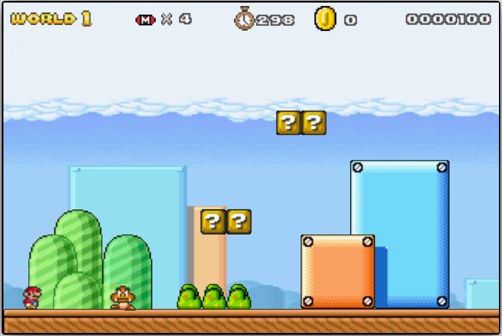
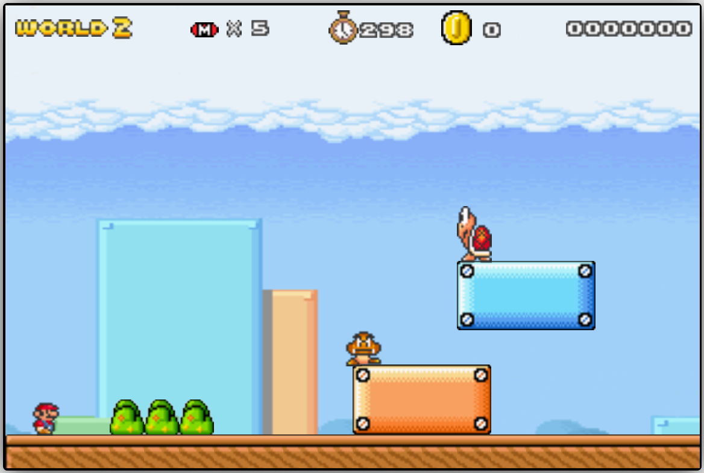
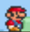
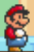
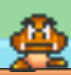
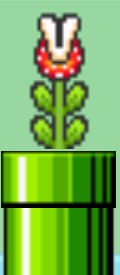
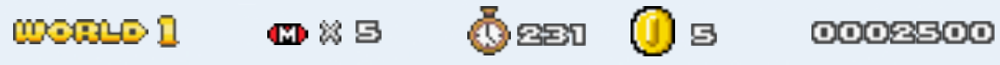
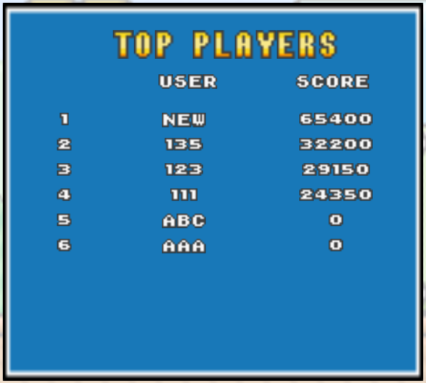

# Software Studio 2021 Spring Assignment 2

## Basic Components
|Component|Score|Y/N|
|:-:|:-:|:-:|
|Membership Mechanism|10%|Y|
|Complete Game Process|5%|Y|
|Basic Rules|45%|Y|
|Animations|10%|Y|
|Sound Effects|10%|Y|
|UI|10%|Y|

## Website Detail Description

# Basic Components Description : 
1. World map : 分為2個stage

* Stage1

* Stage2

2. Player : 使用方向鍵左右移動玩家，方向上鍵讓玩家跳起來

* Small Mario

* big Mario

3. Enemies : 3種Enemies

* Goomba

* Turtle

* Flower

4. Question Blocks : 2種Question Blocks

* Coin : 加1金幣，加100分

* Mushroom : 出現蘑菇，若玩家吃到蘑菇，則變big mario，並加1000分

5. Animations :

* 玩家走、跳、死亡（分為small mario和big mario）

* Goomba移動

* Turtle移動（分為正常移動和縮頭移動）

* Flower上下移動、花瓣開合

6. Sound effects :

* 3種BGM

* 玩家走、跳音效

* 玩家生命減少和game over音效

* 金幣掉落音效

* 蘑菇出現、玩家吃蘑菇音效

* 玩家放大、縮小音效

* 踩敵人音效

* 踢龜殼音效

* 闖關成功音效

7. UI :

# Bonus Functions Description : 
1. 排行榜 : 按出現排行榜

依照分數排行，每個玩家只會取最高分數

